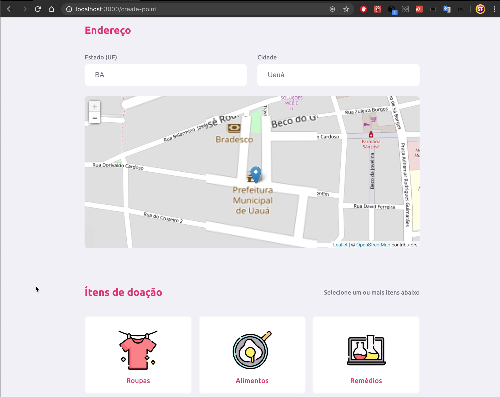
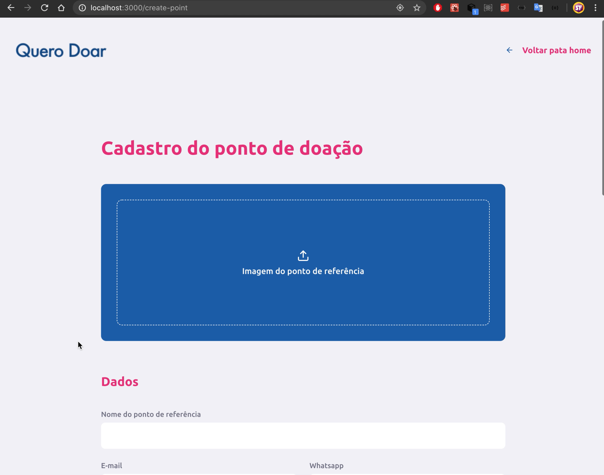
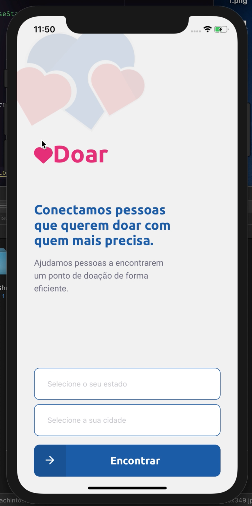
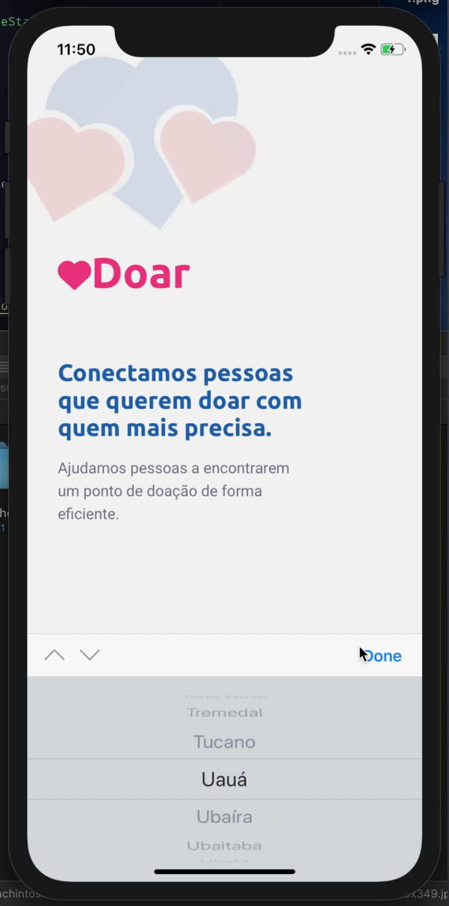
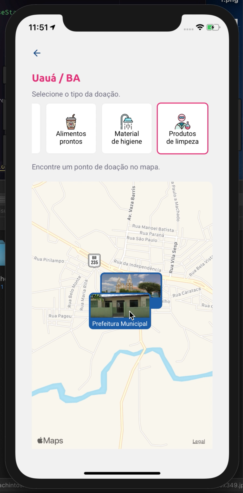
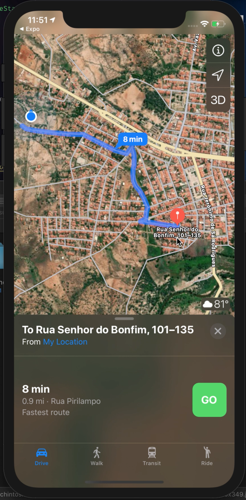

<h1 align="center">
    
</h1>

<h4 align="center">
  🚀 Doar
</h4>

 

## Web

  
  
  

 

## Mobile

  
  
  
  

## Technologies

- [Node.js](https://nodejs.org/en/)
- [React](https://reactjs.org)
- [React Native](https://facebook.github.io/react-native/)
- [Expo](https://expo.io/)
